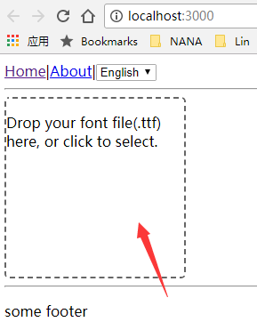
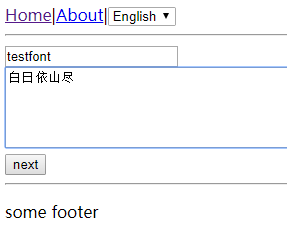
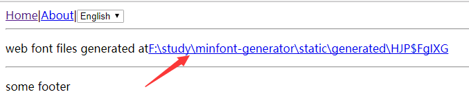
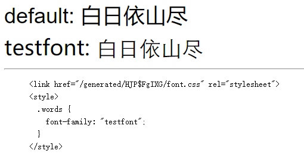
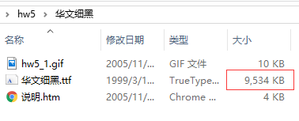
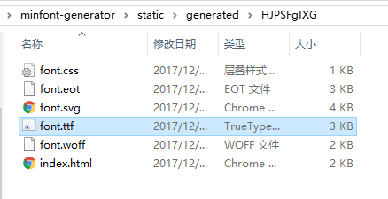

# minfont-generator

generate a css of min font for only used words | 生成只包含你使用文本的最小的字体css

quick glance: https://www.youtube.com/watch?v=eF9gicjUIOw&list=PLM1v95K5B1ntVsYvNJIxgRPppngrO_X4s

## setup | 安装

```
git clone https://github.com/postor/minfont-generator.git && cd minfont-generator
yarn
yarn dev
```

## use | 使用

1.upload your ttf | 上传ttf



2.fill font-family name and words that web font will contain | 填入要使用的字体命名和会用到的文本



3.copy generated local file to your project, or use this program as a host directly (not safe)  | 拷贝生成的文件，或者直接使用本服务（不安全）



4.result | 结果



ttf size before | font文件之前的大小



ttf size after | 之后的大小



